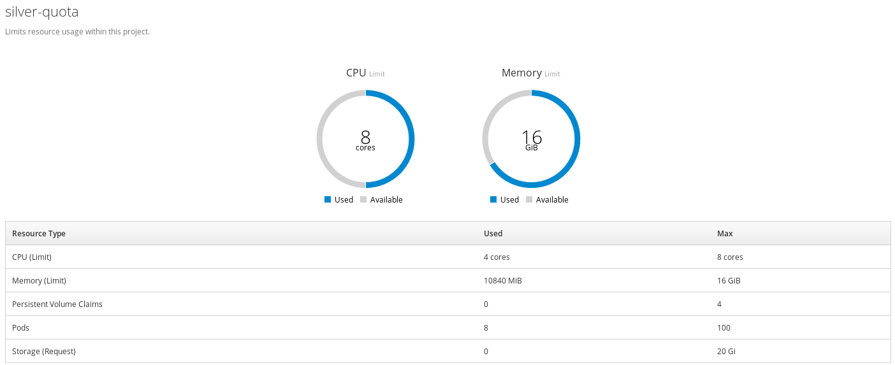

# Quota & Limits

Resources in OpenShift namespace can be limited using quota:



Each OpenShift object (Pod, BuildConfig, DeploymentConfig, ...) can use resource
limits for CPU and memory. If the application exceed the limits it is killed
and redeployed automatically.

```yaml
- apiVersion: v1
    kind: DeploymentConfig
    metadata:
      name: my-app
      labels:
        app: my-app
    spec:
      template:
        spec:
          containers:
            - name: my-app
              resources:
                limits:
                  memory: 256Mi
                  cpu: 1
                requests: 
                  memory: 125Mi
```